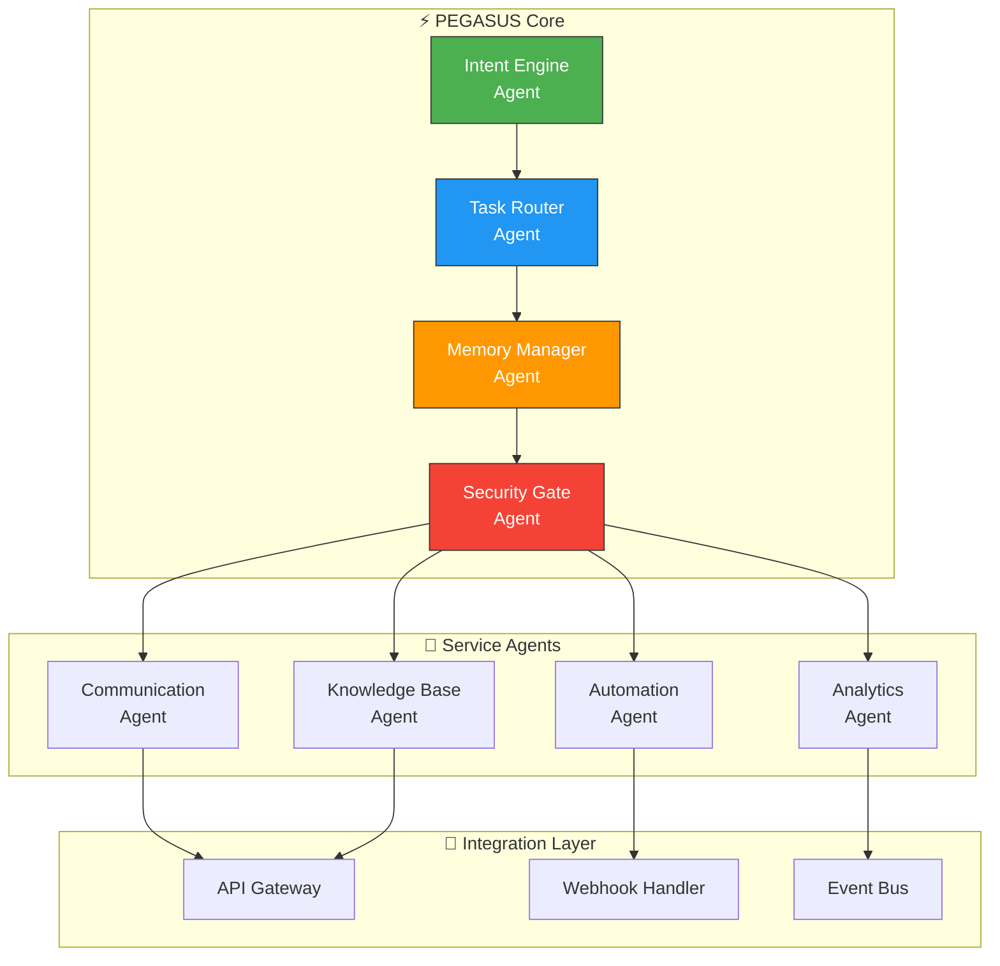

# 🐎 SparkSphearTech PEGASUS — AI Agent Platform

> **PEGASUS: Personal Enterprise-Grade AI System with Unified Services**  
> The flagship AI agent orchestration platform for SparkSphear Tech.

---

## 🧠 PEGASUS AI Agent Architecture

Built by **[Shazaly Musa](https://github.com/SparkSpheartech)** — Founder, SparkSphear Tech  
*Enterprise AI Agent Platform*